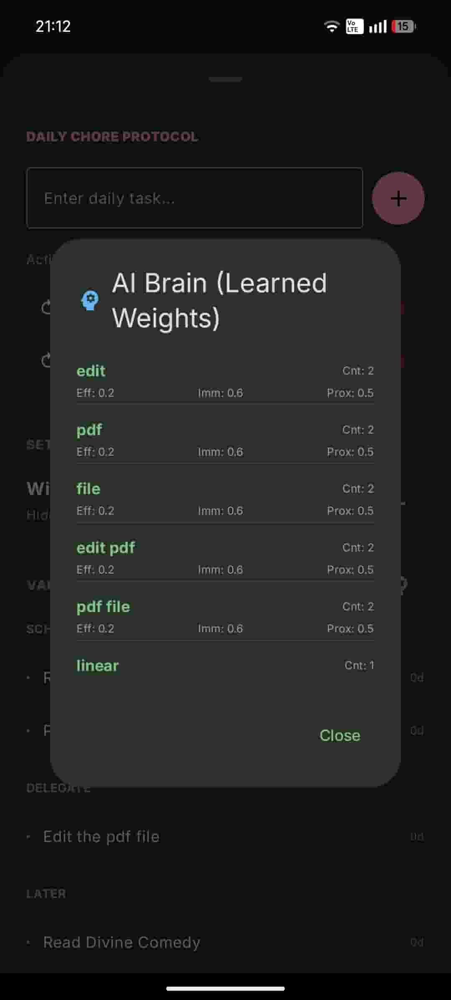

# Sequence

<p align="center">
  
</p>

<p align="center">
  <strong>An alternative to to-do lists for people with ADHD</strong><br>
</p>

<p align="center">
  
  
  
  
  
</p>

<p align="center">
    <a href="https://github.com/Cognaque/Sequence/releases">
        
    </a>
    <a href="https://github.com/Cognaque/Sequence/releases">
        
    </a>
    
    
</p>


---

## ✨ Sequence (ADHD to-do list)

A privacy-focused, offline-first productivity tool designed for the ADHD brain. **Sequence** is not just a to-do list; it is a "Consequence Engine" that uses a local AI to learn how _you_ perceive urgency and importance, helping you overcome executive dysfunction through momentum scoring and automated prioritization.

## ✨ Features

### 🧠 AI Learning Engine

- **Local Intelligence** - A custom `LearningEngine` that tokenizes your tasks and learns from your inputs.
    
- **Predictive Weighting** - Automatically predicts 5 key factors for new tasks based on past history:
    
    - _Immediate Consequences_
        
    - _Long-term Impact_
        
    - _Proximity (Point of No Return)_
        
    - _Accumulation (Compound effect)_
        
    - _Effort (Activation Energy)_
        
- **Training Mode** - A "Clarification Overlay" asks specific questions to train the AI when it encounters unknown tasks.
    

### 📝 Task Protocol

- **Impact & Momentum Scoring** - Tasks are ranked not just by date, but by an `Impact Score` (consequence severity) and `Momentum Score` (bang-for-your-buck).

- **Task Aging - Tracks the lifespan of every task (e.g., "4d Old") and slowly escalates their Impact Score day-by-day so forgotten tasks eventually surface. 

- **Eisenhower Sorting** - Automatically categorizes tasks into Priority, Schedule, Delegate, or Later based on calculated urgency/importance.
    
- **Daily Chores** - Persistent daily routines that regenerate automatically every day (visually distinct in pink).
    
- **Brain Dump** - Quick-capture interface to offload mental clutter immediately.
    

### 🛡️ Neurodivergent-Friendly UX

- **The Vault** - A hidden "Focus Stack" for non-priority items. Access it by long-pressing the "PRIORITY" header for 5 seconds, to keep your main view distraction-free.
    
- **Wind Down Mode** - Automatically filters out high-effort tasks after a configurable hour (default 10 PM) to protect sleep hygiene.
    
- **Visual Dopamine** - Swipe-to-complete with satisfying animations and color transitions based on task urgency.
    
- **Dark Mode Native** - Designed with an OLED-black background to reduce sensory load.
    

### 📊 Insight & Data

- **Brain Memory** - View the raw weights and logic the AI has learned for specific keywords.
    
- **Impact Analysis** - Tap any task to see exactly why it was prioritized (e.g., "Critical Immediate Consequence").
    

## 🛠️ Tech Stack

This application is built as a modern, single-activity Android application.

|Category|Technology|
|---|---|
|**Language**|[Kotlin](https://kotlinlang.org/ "null")|
|**UI Framework**|[Jetpack Compose](https://developer.android.com/jetpack/compose "null") (Material 3)|
|**Architecture**|MVVM (Model-View-ViewModel)|
|**Database**|[Room](https://developer.android.com/training/data-storage/room "null") (SQLite)|
|**Concurrency**|Kotlin Coroutines & `StateFlow`|
|**Animation**|Compose Animation API (`animateColorAsState`, `Canvas`)|
|**DI**|Manual Dependency Injection (`ViewModelFactory`)|
|**Integration**|Android Calendar Intents|

_Note: This app is offline-first and does not require internet permissions._

## 📱 Requirements

- **Android 10** (API 29) or higher recommended.
    
- **Dark Mode** enabled device preferred.
    

## 🚀 Getting Started

### Prerequisites

- Android Studio Ladybug | 2024.2.1 or newer
    
- JDK 11+
    

### Installation

1. **Clone the repository**
    
    ```
    git clone https://github.com/Cognaque/Sequence.git
    ```
    
2. **Open in Android Studio**
    
    - Open Android Studio
        
    - Select "Open an Existing Project"
        
    
    - Navigate to the cloned directory
        
3. **Build & Run**
    
    - Sync Gradle files.
        
    - Connect a device or emulator.
        
    - Click Run (▶️).
        

### How to Use

1. **Brain Dump:** Type any task into the bottom bar (e.g., "Pay electricity bill").
    
2. **Train:** If the AI doesn't recognize the words, it will ask you to rate the consequences (Immediate, Long-term, etc.).
    
3. **Execute:** The app will calculate a score. High-impact tasks float to the top.
    
4. **Vault:** Long-press the "PRIORITY" title at the top to see your backlog (The Vault) or manage Daily Chores.

---

## 🤝 Contributing

Contributions are welcome! Please feel free to submit a Pull Request.

1. Fork the Project
2. Create your Feature Branch (`git checkout -b feature/AmazingFeature`)
3. Commit your Changes (`git commit -m 'Add some AmazingFeature'`)
4. Push to the Branch (`git push origin feature/AmazingFeature`)
5. Open a Pull Request

---

## 📄 License

This project is licensed under the MIT License - see the [LICENSE](LICENSE) file for details.

---

